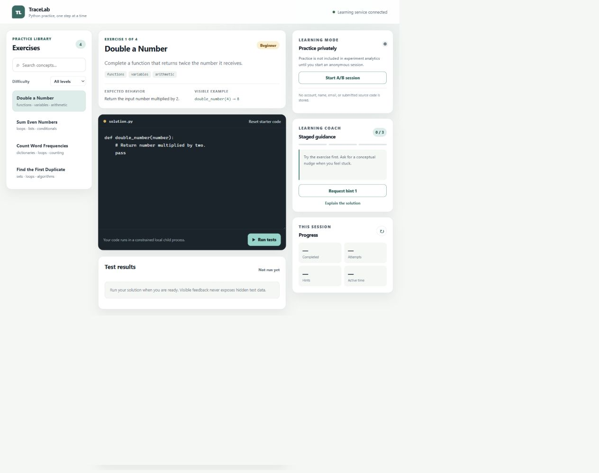

# AI-Assisted Learning Tool

TraceLab is a complete local-first prototype for practicing Python exercises. It explores a
specific learning question: can staged, explanation-focused assistance help
students debug without immediately giving away the answer?

The prototype includes a typed FastAPI service and a curated catalog of four exercises.
Students can browse or filter exercise summaries, retrieve starter code plus visible examples, and
submit solutions to a constrained child-process runner. Hidden evaluation cases stay inside the
domain model and are scrubbed from submission responses. Three staged hint levels and explicit
solution explanations run through a modular offline provider. Anonymous A/B sessions assign and
enforce control or assisted conditions while local SQLite analytics record only learning events. A
responsive vanilla JavaScript workspace connects the complete exercise, submission, assistance,
session, and progress flow. An optional Responses-compatible network provider is available through
environment configuration. No usability study has been conducted and no participant outcomes are
claimed.

## Screenshot



The screenshot shows local practice mode with the bundled offline provider. No participant data is
present.

## Learning flow

1. Browse a small curated exercise catalog.
2. Edit and submit Python code against predefined tests.
3. Inspect concise test failures.
4. Request progressively more specific hints when the assigned condition permits them.
5. Review a solution explanation only after explicitly requesting it.

## Architecture

FastAPI owns the REST boundary and generates interactive API documentation from typed models.
Application services own learning rules, while provider and execution interfaces isolate
the two highest-risk integrations: external AI calls and untrusted code execution. See
[`docs/architecture.md`](docs/architecture.md) for the component diagram and safety boundary.

## Exercise format

Exercises are typed Python objects in `backend/app/content/exercises.py`. Each definition contains
an identifier, title, description, difficulty, concept tags, starter code, expected behavior,
function name, visible examples, hidden evaluation cases, three ordered hints, and a solution
explanation. Public API schemas intentionally omit hidden inputs and expected outputs. This keeps
content authoring straightforward while preventing the browser from receiving answer data.

## Local setup

Requires Python 3.12 or newer. Node.js 24 or newer is needed only for the frontend logic tests.

```powershell
python -m venv .venv
.\.venv\Scripts\Activate.ps1
python -m pip install -r requirements-dev.txt
```

Run the API:

```powershell
$env:PYTHONPATH = "backend"
uvicorn app.main:app --reload
```

Then open `http://127.0.0.1:8000` for the learning workspace or
`http://127.0.0.1:8000/docs` for the generated API documentation.

Current endpoints:

- `GET /api/health`
- `GET /api/exercises`
- `GET /api/exercises?difficulty=beginner&tag=loops`
- `GET /api/exercises/{exercise_id}`
- `POST /api/exercises/{exercise_id}/submit`
- `POST /api/exercises/{exercise_id}/hint`
- `POST /api/exercises/{exercise_id}/explain`
- `POST /api/sessions`
- `POST /api/sessions/{session_id}/confidence`
- `GET /api/sessions/{session_id}/analytics`

Example submission body:

```json
{
  "code": "def double_number(number):\n    return number * 2\n"
}
```

## Code-execution boundary

Submissions are limited to 8 KB and checked for blocked syntax and attributes. Accepted code runs
with restricted built-ins in a separate isolated Python process, temporary directory, sanitized
environment, and two-second timeout. Hidden test inputs and expected values are removed from API
responses.

This is deliberate defense in depth for a local educational prototype, not a secure sandbox for
hostile internet users. It does not provide container-level memory, filesystem, process, or network
isolation. A public deployment must move execution to locked-down disposable containers or a
dedicated sandbox service.

## AI assistance

`AIProvider` separates learning workflows from provider-specific behavior. The current
`MockAIProvider` is deterministic, offline, and requires no API key. It supplies conceptual,
technique-focused, and likely-bug hints; a solution explanation is returned only through the
explicit `/explain` endpoint. Provider identity and fallback reasons remain visible in responses.
See [`docs/ai-design.md`](docs/ai-design.md) for the design and privacy rules.

An optional `OpenAICompatibleProvider` calls a configurable Responses-style endpoint. It sends no
hidden tests or session analytics, requests stateless handling with `store: false`, caps output,
normalizes provider failures, and requires all credentials through environment variables. Its HTTP
contract is tested with mock responses; the project does not claim that a paid live call was run.

## Experiment and analytics

`POST /api/sessions` creates a random anonymous identifier and assigns either the `control` or
`ai_assisted` condition. In experiment mode, send that identifier as the `X-Session-ID` header on
submission and assistance requests. The backend rejects hints and explanations for control
sessions, so the condition is more than a visual toggle. Requests without the header remain
available as ordinary practice mode and are not included in study analytics.

SQLite records outcomes and durations, but not submitted code or identifying profile fields. The
submission `duration_seconds` value is client-reported active time and is capped at two hours per
attempt. See [`docs/experiment-design.md`](docs/experiment-design.md) for the planned procedure,
metrics, limitations, and ethics. This is study infrastructure; it is not evidence that a study
has taken place.

The runnable study package includes the [usability test plan](docs/usability-test-plan.md),
[participant instructions](docs/participant-instructions.md),
[post-study questionnaire](docs/post-study-questionnaire.md), and an explicitly empty
[results template](docs/results-template.md). Recruitment, consent, and any required review must be
handled before involving real participants.

## Frontend workspace

The dependency-free frontend in `frontend/` is served by FastAPI, so local development needs only
one running process. It provides exercise search and filtering, an accessible Python editor,
visible test feedback, progressive hints, explicit explanations, anonymous condition assignment,
confidence input, and a session progress summary. Dynamic API content is inserted with DOM text
nodes rather than HTML strings.

The active-time timer pauses while the page is hidden and resets after each submission. Its state
transitions and other presentation rules are separated into pure JavaScript helpers so they can be
tested without a browser framework.

Run the checks:

```powershell
ruff check backend
pytest
npm test
```

The exact release verification and claim audit are recorded in
[`docs/project-status.md`](docs/project-status.md).

## Environment and secrets

`.env.example` documents the supported settings and `.env` is ignored by Git. The application reads
process environment variables directly; set them in PowerShell or through your deployment secret
manager. The default mock provider requires no key, paid account, or network connection. External
provider setup is documented in [`docs/ai-design.md`](docs/ai-design.md).

## Current limitations

- Exercises are bundled in Python; an authoring/import format has not been added yet.
- The child-process runner is intentionally local-only and not a production security boundary.
- The external provider contract is mock-tested but has not been verified with a live paid request.
- The local analytics store is not suitable for collecting identifying research data.
- The lightweight text editor does not yet provide syntax highlighting or autocomplete.
- The A/B experiment and usability study are designs, not completed research.

## Lessons learned

- Provider interfaces make offline development, deterministic testing, and optional network AI
  possible without changing the learning workflow.
- Separating internal exercise models from public schemas is a reliable way to prevent hidden-test
  leakage.
- Experiment rules must be enforced by the backend; hiding buttons in the browser is not enough.
- Privacy improves when the event model is designed to exclude identity and source code from the
  start rather than trying to remove them later.
- Process isolation, timeouts, syntax checks, and restricted built-ins reduce local risk, but they
  are not substitutes for an operating-system sandbox.

## Future improvements

- Run submissions in disposable containers with memory, filesystem, process, and network controls.
- Evaluate the optional network provider with a privately configured API key and a documented test
  protocol.
- Add syntax highlighting, autocomplete, and an exercise authoring/import workflow.
- Conduct the approved usability study with consenting participants and publish only aggregate,
  honestly collected results.
- Replace local SQLite storage with a deployment-ready data service if multi-user hosting is added.

## License

MIT
