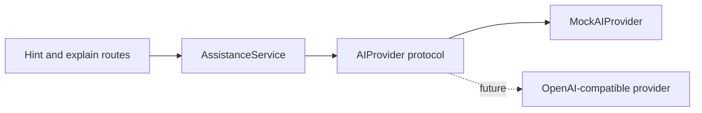

# AI Assistance Design

## Learning goal

The assistant should help a learner make the next reasoning step without immediately replacing
the learning task with a complete answer. Assistance is divided into three explicit levels:

1. conceptual direction;
2. a more specific technique or language feature;
3. likely-bug guidance informed by the current code.

A solution explanation is a separate endpoint and appears only after the learner explicitly asks
for it. The current explanations describe the reasoning and control flow rather than presenting a
copy-paste solution.

## Provider boundary

`AIProvider` uses asynchronous methods so a future network provider will not require redesigning
the API and service layers. `MockAIProvider` is deterministic, offline, and free. It combines
curated hints with a few transparent code observations, which makes the full learning flow usable
and testable without claiming that a language model generated the response.

Provider selection falls back to the mock when an unavailable name is configured. The API returns
the provider name and fallback reason instead of silently pretending the requested provider ran.

## Data and privacy

The provider receives only the selected exercise and the code entered for that exercise. The
current mock sends nothing over the network. A future external-provider implementation must avoid
names, email addresses, session identifiers, analytics records, and hidden test values in prompts.
API keys will come from environment variables and must never be stored in source control.

## Current limitation

No external model provider is implemented yet. Resume material can describe a modular assistance
workflow and offline mock provider, but it should not claim production AI-model integration until
the compatible provider is built and verified.
