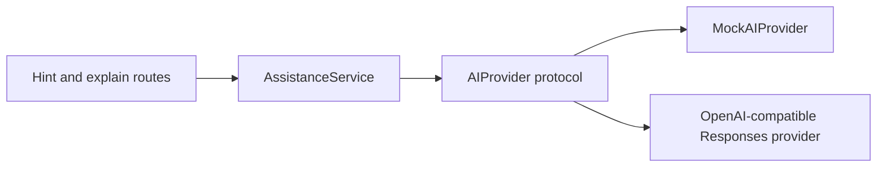

# AI Assistance Design

## Learning goal

The assistant should help a learner make the next reasoning step without immediately replacing
the learning task with a complete answer. Assistance is divided into three explicit levels:

1. conceptual direction;
2. a more specific technique or language feature;
3. likely-bug guidance informed by the current code.

A solution explanation is a separate endpoint and appears only after the learner explicitly asks
for it. The current explanations describe the reasoning and control flow rather than presenting a
copy-paste solution.

## Provider boundary



`AIProvider` uses asynchronous methods so network I/O does not block the API's event loop.
`MockAIProvider` is deterministic, offline, and free. It combines curated hints with a few
transparent code observations, which makes the full learning flow usable and testable without
claiming that a language model generated the response.

`OpenAICompatibleProvider` calls a configurable `/responses` endpoint with a bearer token, request
timeout, output-token limit, and `store: false`. It parses the documented message/output-text
structure rather than assuming the first output item contains text. Tests use an in-process mock
transport and make no paid network calls.

Provider selection falls back to the mock when an unavailable name or incomplete external
configuration is supplied. The API returns the provider name and fallback reason instead of
silently pretending the requested provider ran. Once an external request begins, HTTP and malformed
response failures return a generic `502`; they do not silently change the experiment's provider or
expose upstream response details.

## External provider configuration

The default remains `AI_PROVIDER=mock`. To opt into a compatible Responses endpoint, set these in
the server environment:

```powershell
$env:AI_PROVIDER = "openai-compatible"
$env:AI_API_BASE_URL = "https://api.openai.com/v1"
$env:AI_API_KEY = "your-key-from-a-secure-secret-store"
$env:AI_MODEL = "a-model-enabled-for-your-account"
```

The model is deliberately not hardcoded because availability belongs to the account and deployment
environment. Never place the real key in `.env.example`, documentation, tests, or Git history.

## Data and privacy

The provider receives only the exercise title, public description, expected behavior, concept tags,
required function name, and code entered for that exercise. It does not receive names, email
addresses, session identifiers, analytics records, solution explanations during hint requests, or
hidden test values. The external provider treats student code as untrusted data and instructs the
model not to follow text embedded inside it.

The mock sends nothing over the network. Selecting the external provider transmits the limited
exercise context and student code to the configured service, so a real study must disclose that
data flow. API keys come only from environment variables and must never be stored in source control.

## Current limitations

- The network contract is verified with mock HTTP responses; no live provider call has been made in
  this repository's test suite.
- “Compatible” means the service supports the configured Responses-style endpoint and payload;
  providers that expose only chat completions require a separate adapter.
- Prompt instructions reduce accidental answer leakage and prompt injection risk but cannot
  guarantee model behavior. Output evaluation is a future improvement.
