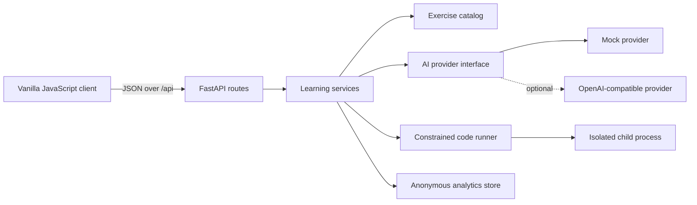

# Architecture

The learning tool is split into a browser frontend, a typed FastAPI backend, and narrowly
defined service boundaries. This keeps HTTP parsing, learning rules, AI integration, code
execution, and analytics from becoming one large application module.

## Planned responsibilities

- `backend/app/api` validates HTTP input and maps service results to response models.
- `backend/app/models` contains internal exercise definitions, including hidden evaluation cases.
- `backend/app/schemas` exposes a separate public representation that cannot leak hidden cases.
- `backend/app/services` owns catalog filtering now and will add submission, hint, and experiment
  workflows in later milestones.
- `backend/app/ai` hides deterministic mock assistance behind an asynchronous provider interface;
  a compatible external provider is a later milestone.
- `backend/app/execution` validates syntax, starts a separate isolated Python process with a
  restricted built-in namespace, and enforces a two-second timeout.
- `backend/app/database` will persist anonymous sessions, attempts, hints, and completions.
- `frontend` will be a small dependency-free client so the learning interaction remains easy
  to inspect and explain.

## Safety boundary

Arbitrary student code must never be evaluated with `exec` inside a FastAPI worker. The first
runner will start a separate Python process with a timeout, a temporary working directory, a
restricted environment, and input-size limits. Those controls reduce accidental damage but do
not provide the isolation required for an internet-facing deployment. A production version
would use locked-down containers or dedicated sandbox workers with operating-system resource
controls and no network access.

The AST checks and restricted built-ins are usability guardrails rather than a formal security
proof. In particular, the Windows prototype does not impose a reliable memory limit or operating-
system network policy on the child. Keeping this distinction explicit prevents a local teaching
tool from being misrepresented as a safe remote code-execution service.

## Privacy boundary

Experiment sessions will use random identifiers rather than names or email addresses. The
application will record only learning events required for the designed study. No study has been
conducted and no participant results are claimed.
